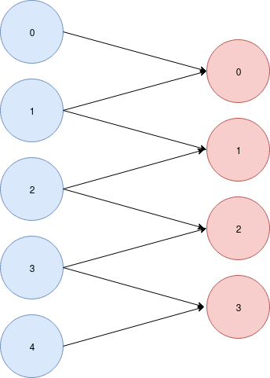

########################
Create your own operator
########################

In this section, we will explain you how to create your own operator usable on your comptable graph.
We will create a convolution operator that gather data with a filter. You can see bellow the graph dependancies between the 
previous layer on our operator's layer.

    Red : previous labmda instanciation, Blue : our conv operator instanciation.

Distribution
-------------

The first think you have to do is the Distributor class. This class will generate the link between the previous and the next layer.

It class shall implement the `Dispenser` interface which contain a `distribute` function. This function take one argument equals to the previous layer size and 
must return a graph link data structure.  

This data structure is pretty simple. It is a list with one element per lambda instance in the new layer, in our example the list will contain 4 elements.
One element is a list of index that represent a dependancy. All index in this data structure are relative to previous layer order (number writen in the red node).

If we execute this function with the provided example above, we have to find out this result : 

.. code-block:: python3 

    ourDispenser.distribute(5) -> [ [0,1], [1,2], [2,3], [3,4] ]

Now we have to code this ! You can find my implementation bellow, it's not essential so I wont explain it.

.. code-block:: python3 

    class ConvOpDispenser(pyLambdaFlow.Dispenser):

        def distribute(self, size):

            dep_data = list()
            for i in range(size-1):
                dep_data.append([i,i+1])

            return dep_data

Now we can create our operator this by using the previous class.

.. code-block:: python3 

    class ConvOp(pyLambdaFlow.Operation):
        def __init__(self, parent, funct, name=None):
            super().__init__(parent, funct, ConvOpDispenser(), name=name)

That's it ! You should be able to use this in your own project ! But keep in mind that your kernel should take only one argument, even if you provide multiple data.

Multi Sources
-------------

An other good feature is the multi source behaviour. You can use your custom operator with multiple layer.
pyLambdaFlow will use your Dispenser function twise (with the first and the second layers) and provide data to your kernel.

But your kernel have to handle multiple arguments. For instance, I can use the ConvOp operator and provide two differents sources like this : 

Here is a main script sample.

.. code-block:: python3

    a = pyLambdaFlow.Source()

    b= pyLambdaFlow.Source()

    c = ConvOp([a,b]) # Multi source definition

Your kernel has to handle 2 arguments :

.. code-block:: python3

    def lambda_handler(left, right):

        return (left[0]+left[1]+right[0]+right[1])/4

        